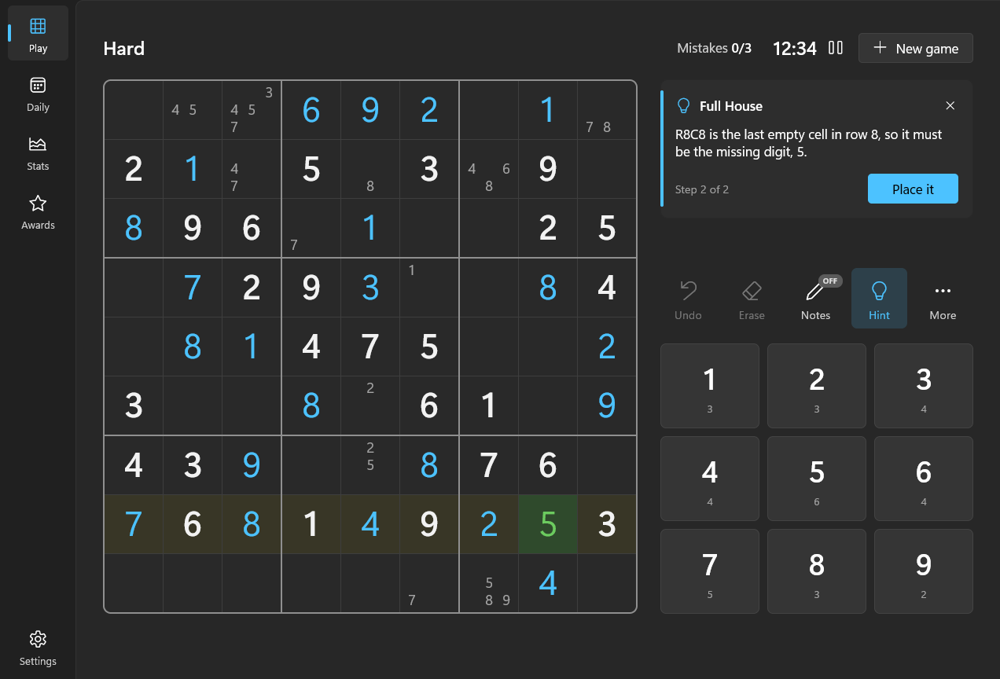
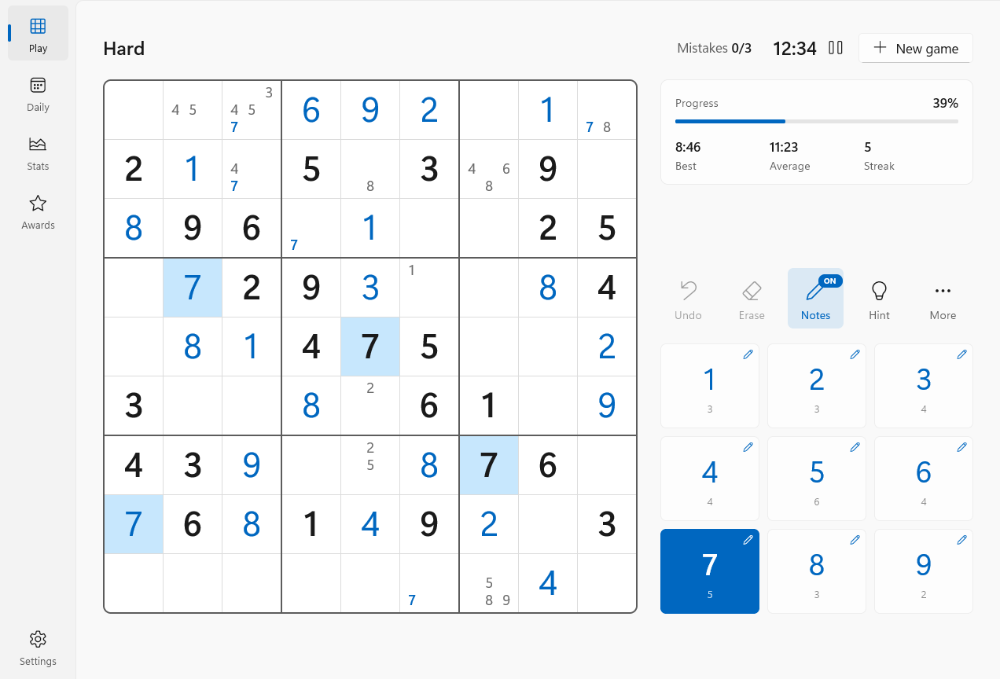
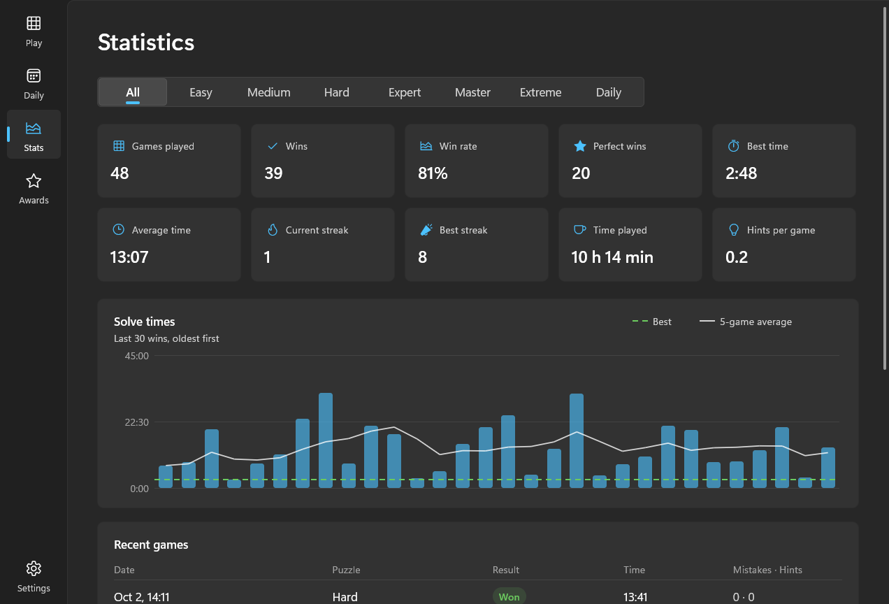
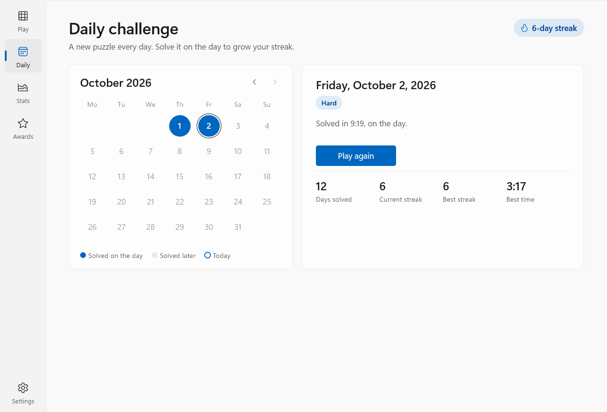
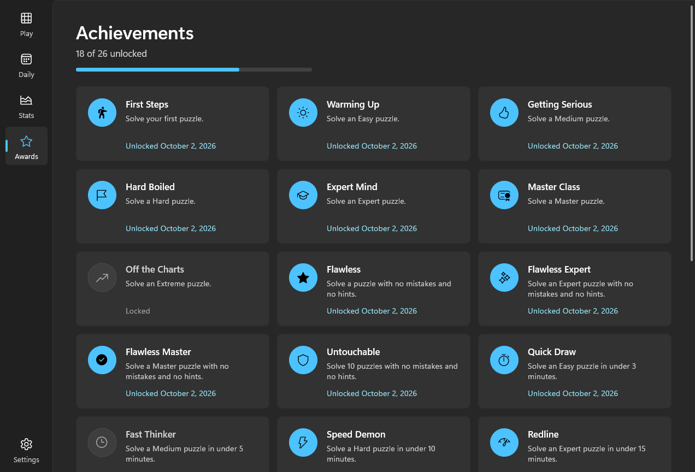
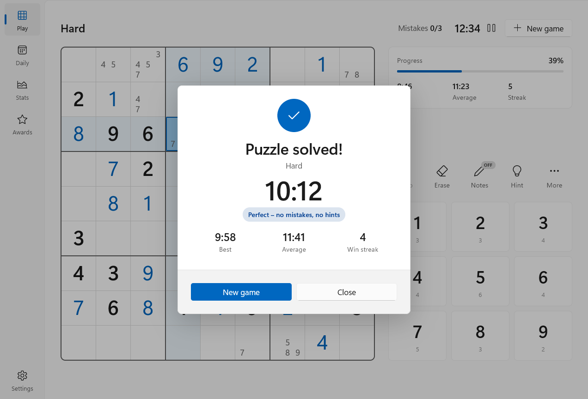

# Sudoku for Windows on ARM

A fast, native Sudoku game for Windows 11 on ARM64. It is written in C++23 on top of Win32,
Direct2D and DirectWrite and compiled straight to AArch64 machine code. There is no runtime, no x64
emulation and nothing to install: the whole game is a single ~570 KB `.exe`.



## Highlights

- **Six difficulty levels**, from Easy to Extreme. Every puzzle has exactly one solution and is graded
  by the human solving techniques it actually requires, not just by how many clues it has.
- **Hints that teach.** Press **H** for a nudge ("look at box 5"). Press it again for the full
  reasoning with the pattern highlighted on the board, then apply it. There are 27 techniques,
  from Hidden Singles to X-Wings, XY-Chains and forcing chains, each explained in plain English.
- **Notes done right:** one-click auto-notes, notes that clean themselves up when you place a number,
  digit-first input, and highlighting of matching numbers and candidates.
- **Unlimited undo/redo** that survives closing the app, plus a mistake limit (with a second chance),
  conflict marking, and row, column and box highlighting.
- **Time and statistics:** a timer that pauses itself when you switch away, plus per-difficulty games,
  wins, win rate, perfect wins, best and average times, streaks, total play time, a solve-time chart
  and your recent games.
- **Daily challenge:** a new puzzle every day (the same on every PC), with a calendar and day streaks.
- **26 achievements**, with progress bars and unlock dates.
- **Windows 11 look:** Mica backdrop, light/dark/system theme, your Windows accent colour (or six
  others), Segoe UI Variable and Fluent icons, crisp at any display scaling, subtle animations and
  optional sound effects.
- **Autosave everywhere.** Close it at any moment and continue exactly where you left off.

## Screenshots

<table>
  <tr>
    <td width="50%"></td>
    <td width="50%"></td>
  </tr>
  <tr>
    <td align="center">Notes mode, with the digit 7 locked</td>
    <td align="center">Statistics and solve-time chart</td>
  </tr>
  <tr>
    <td width="50%"></td>
    <td width="50%"></td>
  </tr>
  <tr>
    <td align="center">Daily challenge</td>
    <td align="center">Achievements</td>
  </tr>
  <tr>
    <td width="50%"></td>
    <td width="50%"></td>
  </tr>
  <tr>
    <td align="center">Puzzle solved</td>
    <td align="center">A hint explaining the next step</td>
  </tr>
</table>

## Getting started

### Requirements

- An ARM64 PC running Windows 11 (or Windows 10).
- The [LLVM-MinGW](https://github.com/mstorsjo/llvm-mingw) toolchain (clang 22 or newer), which is
  free and installs in one step:

  ```powershell
  winget install MartinStorsjo.LLVM-MinGW.UCRT
  ```

No Visual Studio, Windows SDK, CMake or .NET is needed.

### Build and run

```powershell
git clone git@github.com:bs727coding/Sodoku.git
cd Sodoku
.\build.ps1 -Run
```

The game is written to `build\release\Sudoku.exe`. Copy it anywhere, pin it to Start or create a
desktop shortcut to it; it only depends on DLLs that ship with Windows.

| Command | What it does |
|---|---|
| `.\build.ps1` | Optimized build to `build\release\Sudoku.exe` |
| `.\build.ps1 -Run` | Build, then launch the game |
| `.\build.ps1 -Test` | Build and run the test suite and benchmarks |
| `.\build.ps1 -Config debug` | Unoptimized build with a PDB, for debugging |
| `.\build.ps1 -Native` | Generate code for the Snapdragon X (Oryon) cores specifically |
| `.\build.ps1 -Clean` | Delete the build output |

<details>
<summary>What the build script does</summary>

1. `clang++` compiles every `src/**/*.cpp` to an AArch64 object file, in parallel (one process per
   core) and incrementally (only files whose sources or headers changed are rebuilt). Flags:
   `-O2 -flto=thin -march=armv8.2-a -mtune=oryon-1`. The ARMv8.2 baseline runs on every Windows 11
   ARM PC, while instruction scheduling is tuned for Snapdragon X.
2. `llvm-windres` compiles `res/app.rc`: the icon, the application manifest (per-monitor DPI v2,
   UTF-8) and version info.
3. `lld` links a single executable. libc++ is linked statically, and the C runtime is the Universal
   CRT that is part of Windows, so there are no DLLs to ship.

`llvm-objdump -f build\release\Sudoku.exe` reports `coff-arm64`.
</details>

## How to play

Fill the grid so every row, column and 3×3 box contains the digits 1–9 exactly once.

**With the mouse:** click a cell, then a number on the pad. Or click a number first (with no cell
selected) to *lock* it, then click cells to place it. Toggle **Notes** to pencil in candidates.

**With the keyboard:**

| Keys | Action |
|---|---|
| Arrow keys | Move the selection |
| 1–9 | Place a number (a note in notes mode) |
| Shift + 1–9 or Alt + 1–9 | Toggle a note |
| 0 · Delete · Backspace | Erase |
| N · Space | Notes mode on/off |
| A | Fill in all notes |
| Ctrl+Z · Ctrl+Y | Undo · redo |
| H | Hint (press again for the explanation) |
| Enter | Apply the hint |
| P · Esc | Pause |
| Ctrl+N | New game |
| Ctrl+1 … 5 | Play · Daily · Stats · Awards · Settings |
| F11 | Full screen |
| F1 | Shortcut sheet |

## Difficulty levels

Each puzzle is solved by a logic engine that always uses the simplest technique available. Its
difficulty is the hardest technique the solve needed.

| Level | Hardest technique needed |
|---|---|
| Easy | Singles only (36–42 clues) |
| Medium | Up to locked candidates (30–35 clues) |
| Hard | Naked and hidden pairs and triples |
| Expert | X-Wing, Swordfish, Skyscraper, 2-String Kite, XY/XYZ/W-Wing, Simple Coloring, quads, Unique Rectangle |
| Master | Jellyfish, finned X-Wing and Swordfish, X-Chain, XY-Chain, BUG+1 |
| Extreme | Forcing chains |

Puzzles are generated in the background. Two low-power (EcoQoS) threads keep a few ready for each
level, and every core joins in if you ask for one that isn't ready, so **New game** is instant.

## Your data

Saves, settings, game history and achievements live in `%LOCALAPPDATA%\Sudoku`
(**Settings → Data → Open folder**). The game history (`history.csv`) is the single source for every
statistic, so it is easy to inspect or back up.

To keep everything next to the executable instead (for example on a USB stick), create an empty
file named `portable` beside `Sudoku.exe`. Data then goes to a `data` folder next to it.

## How it works

```
src/
  engine/   Pure C++ Sudoku engine, no Windows headers, fully unit-tested
            solver      bitmask constraint propagation + minimum-remaining-values search
            logic       27 human techniques, ordered easiest first (grading and hints)
            explain     plain-English explanations for every technique
            generator   random grid -> symmetric clue removal -> grade until the level matches
  game/     Game session (moves, notes, undo, mistakes, hints, save format), history and
            statistics, achievements, settings, file storage, background puzzle pool
  ui/       Direct2D / DirectComposition renderer, Fluent theme, widgets, board view
  *.cpp     App: input handling, pages, dialogs, sounds, the main window and message loop
tests/      Engine and game test suite
tools/      Icon generator
res/        Icon, application manifest, resource script
docs/       README screenshots
```

Rendering goes D3D11 → a premultiplied-alpha DirectComposition swap chain → Direct2D, so the Mica
backdrop shows through the window. Frames are drawn only when something changes and are paced by a
waitable swap chain, so the game uses essentially no CPU while you think.

### Performance

Measured on a Snapdragon X Elite:

- The window is on screen about **0.2 s** after launch.
- About **0% CPU when idle**. The timer repaints once a second, and nothing else runs until you act.
- About **27 MB** of private memory.
- A uniqueness check takes about **22 µs**, and an Expert puzzle generates in a few milliseconds.

One finding worth noting: the Qualcomm GPU driver reserves about 70 MB of memory once a frame
contains more than a few dozen anti-aliased geometric shapes. Rounded rectangles, circles and rings
are therefore drawn from small, cached, anti-aliased alpha masks (corner and circle tiles) instead of
tessellated geometry. Text layouts are also cached across frames. Together these cut memory from about
96 MB to 27 MB and per-frame CPU by about 4×, without changing how anything looks.

## Testing

```powershell
.\build.ps1 -Test          # add -TestArgs "--full" for a longer run
```

The suite (about 60,000 checks) covers the solver against known hard puzzles, uniqueness detection,
puzzle generation for every level, and **soundness of every technique**: each finder runs on
thousands of real board states and must never place a wrong digit or eliminate a correct one. It
also covers solving whole puzzles using only hints, daily-puzzle determinism, game rules (mistakes,
second chances, undo), save/load round trips, statistics and streaks, achievements and settings.

## Developer notes

- `Sudoku.exe --screenshot <page> <light|dark> <W>x<H> <scale> <out.png>` renders a page offscreen
  with demo data. It never touches your saved data. Pages: `play`, `hint`, `notes`, `paused`,
  `win`, `gameover`, `help`, `flyout`, `picker`, `daily`, `stats`, `achievements`, `settings`.
- `tools\make_icon.ps1` regenerates `res\app.ico`.

## License

Released under the [MIT License](LICENSE).
